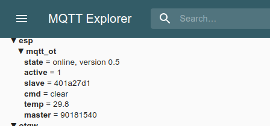
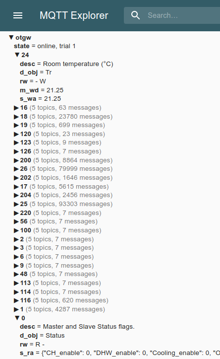

# OpenTherm monitoring using MQTT

This package translates the OpenTherm data transfers, as monitored by
the ESP OpenTherm MQTT gateway, into understandable MQTT topics and
messages. 

It provides auto-discovery of many (binary-)sensors for home-assistant.

The project is based upon the 2003 [V2.2 specification of OpenTherm](http://files.domoticaforum.eu/uploads/Manuals/Opentherm/Opentherm%20Protocol%20v2-2.pdf)

## Requirements

Have the ESP OpenTherm gateway hardware installed running the 
[OpenTherm MQTT gateway software](https://github.com/joshuisken/ot_mqtt_esp) 

## Build/install

`python -m build`

`pip install .`

## Run

The program `otmqtt` needs a `otmqtt.ini` file with configuration settings and secrets.
An example is generated on the first invocation:

```
$ otmqtt
Writing default config to 'mqtt_ot.ini'
Not connected to MQTT broker, did you fill-in credentials in 'mqtt_ot.ini'?
```

After connecting to the MQTT-broker `otmqtt` interprets the results of the 
[OpenTherm MQTT gateway software](https://github.com/joshuisken/ot_mqtt_esp) 



into something more comprehensible 



Registers which appear and are not specified in the V2.2 OpenTherm
spec are reported.


Additionally, it provides auto-discovery messages of all observed
V2.2 OpenTherm Registers for [Home
Assistant](https://www.home-assistant.io/integrations/mqtt/#mqtt-discovery)
under topics
`homeassistant/sensor/OpenThermGW/#/config` and
`homeassistant/binary_sensor/OpenThermGW/#/config` using `#` as the
wildcard for the sensor names. 
